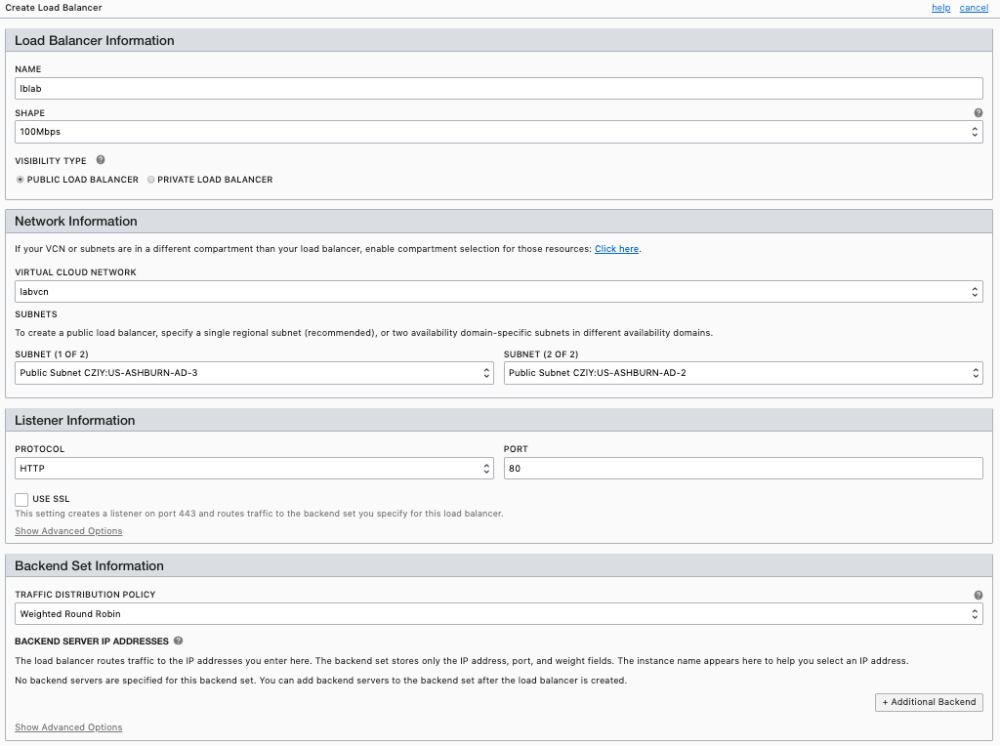
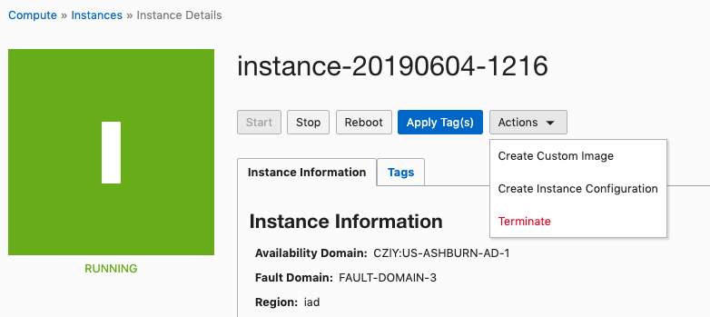

# Configuring Auto Scaling

## Table of Contents

[Overview](#overview)

[Pre-Requisites](#pre-requisites)

[Sign in to OCI Console and create VCN](#sign-in-to-oci-console)
[Configure the Network](#configure-the-network)
[Configure the load balancer](#configure-the-load-balancer)

[Configure Auto Scaling](#configure-auto-scaling)

[Test it!](#test-it!)


## Overview

In this Lab you will build a load-balanced Web Application that can  automatically scale out/in, based on CPU utilization.

You will create a compute instance, obtain an instance configuration and then configure an Instance Pool with auto scaling and load balancer.  
You will also configure a cloud-init script to self setup the instances automatically added to the pool.  
The load balancer will distribute the traffic among all the instances in the pool thus the Backend Set will automatically add/remove the instances in the pool while scaling.  
You will then verify the auto scaling behavior as configured threshold on CPU are crossed  

---
Auto scaling enables you to automatically adjust the number of Compute instances in an instance pool based on performance metrics such as CPU utilization. This helps you provide consistent performance for your end users during periods of high demand, and helps you reduce your costs during periods of low demand.

You select a performance metric to monitor, and set thresholds that the performance metric must reach to trigger an autoscaling event. When system usage meets a threshold, autoscaling dynamically allocates resources in near-real time. As load increases, instances are automatically provisioned: the instance pool scales out. As load decreases, instances are automatically removed: the instance pool scales in.

Autoscaling relies on performance metrics that are collected by the Monitoring service. These performance metrics are aggregated into one-minute time periods and then averaged across the instance pool. When three consecutive values (that is, the average metrics for three consecutive minutes) meet the threshold, an autoscaling event is triggered.

A cooldown period between autoscaling events lets the system stabilize at the updated level. The cooldown period starts when the instance pool reaches a steady state. Autoscaling continues to evaluate performance metrics during the cooldown period. When the cooldown period ends, autoscaling adjusts the instance pool's size again if needed.


### Pre-Requisites

1. OCI Training : https://cloud.oracle.com/en_US/iaas/training

2. Familiarity with OCI console: https://docs.us-phoenix-1.oraclecloud.com/Content/GSG/Concepts/console.htm

3. Overview of Networking: https://docs.us-phoenix-1.oraclecloud.com/Content/Network/Concepts/overview.htm

4. Familiarity with Compartment: https://docs.us-phoenix-1.oraclecloud.com/Content/GSG/Concepts/concepts.htm

5. Connecting to a compute instance: https://docs.us-phoenix-1.oraclecloud.com/Content/Compute/Tasks/accessinginstance.htm

6. Familiarity with Load Balancer concepts.

>__Note__: 
All screen shots are examples only. As OCI UI is being frequently updated, some screenshot might be different than actual UI

---

## Sign in to OCI Console

Sign it to your OCI tenancy with an user with the following privileges in the designed Compartment:
- manage compute-family
- manage network-family
- manage loadbalancer

## Configure the network
1. Sign in using your tenant name, user name and password. 

2. Create or Select the __Compartment__ you want to use to create resources for this lab

3. From the OCI Services menu, create a __Virtual Cloud Network__. 
	> __Tip__: You can select the option _Create Virtual Cloud Network Plus Related Resources:_  that will provide you with a default basic network configuration.
4. Edit __Default Security List__ in _Security Lists_ menu on VCN details page.
5. Add an __Ingress rule__ with the below characteristics:
   - _Stateless_: False
   - _Source CIDR_: 0.0.0.0/0
   - _IP Protocol_: tcp
   - _Source Port_: None
   - _Destination Port_: 80

## Configure the load balancer

1. From OCI services menu, Click __Load Balancer__ under __Networking__
2. Setup a Load Balancer with the below characteristics:
    - _Visibility_: Public
    - _Listener_: HTTP/80
    - _Backend Set Traffic Distribution Policy_: Round Robin
    - _Backend Servers_: None



## Configure instance pool 

Configure instance pool requires creating a instance configuration. 

1. From OCI services menu, Click **Instances** under **Compute** 

2. Setup the instance with the below characteristics:

   - _Image Operating System_:For the image, we recommend using the latest Oracle Linux available.
   - _Instance Type_:  Virtual Machine
   - _Instance Shape_: Select a shape
   - _Boot Volume_: Leave the default
   - _SSH Key_: Paste you public SSH key or upload the Public Key file
   - _VCN_: Select the VCN created earlier
   - ___Advanced Options___
     - _Management_: Paste the below cloud-init script
    ```YAML
   #cloud-config
   packages:
   - httpd
   - stress

   runcmd:
   - [sh, -c, echo "<html>Web Server IP `hostname --ip-address`</html>" > /var/www/html/index.html]
   - [firewall-offline-cmd, --add-port=80/tcp]
   - [systemctl, start, httpd]
   - [systemctl, restart, firewalld]
   ```

3. Wait for Instance to be in **Running** state. 

4. Open Instance details and __Create Instance Configuration__ from _Action_ menu



5. From the Instance Configuration details page, Click __Create Instance Pool__.

6. Create an Instance Pool with the below characteristics:
   - _Number of instances_: 0  
   (This is the number of computes that should be launched when the pool is created. We will start with no compute)

   - _Instance Configuration_: Choose the instance configuration created earlier  
   (Any computes launched in this pool will inherit shape, image and ssh keys of the compute whose instance configuration we are using)

   - _Attach Load Balancer_: Select the Load Balancer created earlier, the Backend Set and set port 80.
   - _Availability Domain_: Choose the AD you want to places instances in.
   - _VCN and Subnet_: Choose the VCN created earlier and the Subnet in available in the selected AD.
   - Click __+ Additional Selection__ and select a different Availability Domain for the instance pool. Then, specify the VCN details for the second availability domain.

   > We configured instances to be deployed in two different Avaialability Domains, though they can be deployed in the same Availability Domain as long as service limits allow it.

7. Click **Create Instance Pool**. Wait for Instance Pool to be in **RUNNING** state (turns green)

8. You can now terminate the original instance created earlier, as this is not part of the pool.

## Configure Auto Scaling

1. From OCI Services menu, Click __Autoscaling Configuration__ under _Compute_

2. Setup the configuration with the below characteristics:

   - _Instance Pool_: Choose your instance pool name created earlier
   - _Cooldown in Seconds_: 300  
   (This is the minimum and the default period of time between scaling actions)
   - _Performance Metric_ : CPU Utilization  
   (This is the Metric to use for triggering scaling actions.)
   - _Minimum Number of Instances_ : 1
   - _Maximum Number of Instances_ : 2
   - _Initial Number of Instances_ : 1
   - _Scale-out Operator_: Greater than (>)
   - _Threshold Percentage_: 10
   - _Number of Instances to Add_ : 1
   - _Scale-in Operator_ : Less than (<)
   - _Threshold Percentage_ : 5
   - _Number of Instances to Remove_  : 1


> We have now created a auto scaling policy that will start with creating 1 compute instance in the designated pool. Once the CPU utilization is determined to be above 10% for atleast 300 seconds another compute instance will be launched automatically.   
Once the CPU utilization is determined to be less than 5% for 300 seconds, one compute instance will be removed.  
At all times there will be atleast 1 compute instance in the pool**

## Test it!

1. Click **Instance Pools** under _Compute_ and then your pool name. It should be in __Scaling__  status while the pool is creating the first intance.  
When the status change to __Running__, wait a couple of more minutes, so that the cloud-init script has time to complete. Clik on the instance name and note down the Public and Private IPs from the details page (under _Primary VNIC Information _section)

2. Connect with your Browser to the Load Balancer Public IP Address. It should respond with the Private IP of the (only Compute instance running)

3. Connet via SSH to the Public IP of the instance in the pool and run the below command to start a stress simulation.

4. Now start CPU stress, Enter command:

   ```Bash
   sudo stress --cpu 4 --timeout 350
   ```

   This will spawn 4 workers spinning on sqrt() with a timeout of 350 seconds.

5. Switch back to OCI console and navigate to Instance Pool details page. Click your instance name and scroll down to **Metric** screen, you should see CPU spiking up after a minute or so.

6. Navigate to your Instance Pool details page. In about 3-4 minutes (time configured when we created auto scale configuration), Pool status should change to **Scaling** and a second compute instance should launch.  
When the status change to __Running__, wait a couple of more minutes, so that the cloud-init script has time to complete. 
   > his is since our criteria of CPU utilization > 10 was met

7. Use your browser to reconnect to the Public IP of the Load Balancer. Refreshing the page you should obtain the private IPs of both the instances in the pool.

8. Navigate to Instanse pool details page and after 3-4 minutes Instance Pool status will change to **Scaling** again. One of the compute instances will be deleted. 
   >This is because our criteria of CPU utilization < 5 is met

***Congratulations! You have successfully completed the lab. ***


---
 _Written by Andrea Marchesini_
